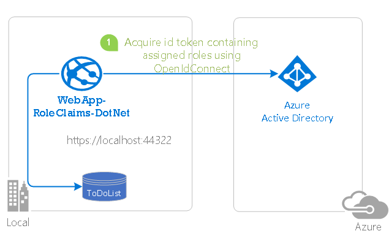

# Authorization in a web app using Azure AD application roles & role claims


## About this sample

### Overview

This sample demonstrates a .NET 4.6 Web App (MVC) application secured using Azure Active Directory using Azure AD Application Roles for authorization.

This application implements RBAC using Azure AD's Application Roles & Role Claims feature. Another approach is to use Azure AD Groups and Group Claims, as shown in [WebApp-GroupClaims-DotNet](https://github.com/Azure-Samples/WebApp-GroupClaims-DotNet). Azure AD Groups and Application Roles are by no means mutually exclusive; they can be used in tandem to provide even finer grained access control.

Using RBAC with Application Roles and Role Claims, developers can securely enforce authorization policies with minimal effort on their part.

- An Azure AD Office Hours session covered Azure AD App roles and security groups, featuring this scenario and this sample. Watch the video [Using Security Groups and Application Roles in your apps](https://www.youtube.com/watch?v=V8VUPixLSiM)

For more information about how the protocols work in this scenario and other scenarios, see [Authentication Scenarios for Azure AD](http://go.microsoft.com/fwlink/?LinkId=394414).

> Looking for previous versions of this code sample? Check out the tags on the [releases](../../releases) GitHub page.



## Scenario

This MVC web application is a simple "Task Tracker" application that allows users to create, read, update, and delete tasks. Within the application, access to certain functionality is restricted to subsets of users. For instance, not every user has the ability to create a task.

This kind of authorization is implemented using role-based access control (RBAC). When using RBAC, an administrator grants permissions to roles, not to individual users or groups. The administrator can then assign roles to different users and groups to control who has access to what content and functionality.  

Our Task Tracker application defines the following four *Application Roles*:

- `Admin`: Has the ability to perform all actions, as well as manage the Application Roles.
- `Writer`: Has the ability to create tasks.
- `Approver`: Has the ability to change the status of tasks.
- `Observer`: Only has the ability to view tasks and their statuses.

These application roles are defined in the [Azure portal](https://portal.azure.com) in the application's registration manifest.  When a user signs into the application, Azure AD emits a `roles` claim for each role that the user has been granted individually to the user and from their group membership.  Assignment of users and groups to roles can be done through the portal's UI, or programmatically using the [Microsoft Graph](https://graph.microsoft.com).  In this sample, application role management is done through the Azure portal.

NOTE: Role claims are not currently emitted in SAML tokens, only JWTs (see issue #1).

NOTE: Role claims are not currently emitted for guest users in a tenant (see issue #2).

## How to run this sample

To run this sample, you'll need:

- [Visual Studio 2017](https://aka.ms/vsdownload)
- An Internet connection
- An Azure Active Directory (Azure AD) tenant. For more information on how to get an Azure AD tenant, see [How to get an Azure AD tenant](https://azure.microsoft.com/en-us/documentation/articles/active-directory-howto-tenant/)
- A user account in your Azure AD tenant. This sample will not work with a Microsoft account (formerly Windows Live account). Therefore, if you signed in to the [Azure portal](https://portal.azure.com) with a Microsoft account and have never created a user account in your directory before, you need to do that now.

### Step 1:  Clone or download this repository

From your shell or command line:

`git clone https://github.com/Azure-Samples/active-directory-dotnet-webapp-roleclaims.git`

> Given that the name of the sample is pretty long, and so are the name of the referenced NuGet pacakges, you might want to clone it in a folder close to the root of your hard drive, to avoid file size limitations on Windows.

### Step 2:  Register the sample with your Azure Active Directory tenant

There is one project in this sample. To register the application, you can:

- either follow the steps in the paragraphs below ([Step 2](#step-2--register-the-sample-with-your-azure-active-directory-tenant) and [Step 3](#step-3--configure-the-sample-to-use-your-azure-ad-tenant))
- or use PowerShell scripts that:
  - **automatically** create for you the Azure AD applications and related objects (passwords, permissions, dependencies)
  - modify the Visual Studio projects' configuration files.

If you want to use this automation, read the instructions in [App Creation Scripts](./AppCreationScripts/AppCreationScripts.md)

#### Step 1: choose the Azure AD tenant where you want to create your applications

As a first step you'll need to:

1. Sign in to the [Azure portal](https://portal.azure.com).
1. On the top bar, click on your account, and then on **Switch Directory**.
1. Once the *Directory + subscription* pane opens, choose the Active Directory tenant where you wish to register your application, from the *Favorites* or *All Directories* list.
1. Click on **All services** in the left-hand nav, and choose **Azure Active Directory**.

> In the next steps, you might need the tenant name (or directory name) or the tenant ID (or directory ID). These are presented in the **Properties**
of the Azure Active Directory window respectively as *Name* and *Directory ID*

#### Register the service app (TaskTrackerWebApp-RoleClaims)

1. In the  **Azure Active Directory** pane, click on **App registrations** and choose **New application registration**.
1. Enter a friendly name for the application, for example 'TaskTrackerWebApp-RoleClaims' and select 'Web app / API' as the *Application Type*.
1. For the *Sign-on URL*, enter the base URL for the sample. By default, this sample uses `https://localhost:44322/`.
1. Click **Create** to create the application.
1. In the succeeding page, Find the *Application ID* value and record it for later. You'll need it to configure the Visual Studio configuration file for this project.
1. Then click on **Settings**, and choose **Properties**.
1. For the App ID URI, replace the guid in the generated URI 'https://\<your_tenant_name\>/\<guid\>', with the name of your service, for example, 'https://\<your_tenant_name\>/TaskTrackerWebApp-RoleClaims' (replacing `<your_tenant_name>` with the name of your Azure AD tenant)
1. From the **Settings** | **Reply URLs** page for your application, update the Reply URL for the application to be `https://localhost:44322/`
1. For **Logout URL**, provide the value `https://localhost:44322/Account/EndSession`
1. Configure Permissions for your application. To that extent, in the Settings menu, choose the 'Required permissions' section and then, click on **Add**, then **Select an API**, and type `Microsoft Graph` in the textbox. Then, click on  **Select Permissions** and select **Directory.Read.All**, **User.Read**.
1. Navigate back to **Azure Active Directory** pane, and click on *Enterprise applications*.
1. Click the "All Applications" tab, and locate the newly created entry for "WebApp-RoleClaims-DotNet" Click on it.
1. On the following page, click on the "Users" tab.  Select any user, click the "Assign" button in the bottom tray, and assign the user to an Application Role.  Repeat this process for any users you would like to have access to Tasks in the application.

#### Step 2: Define your Application Roles

1. While still in the blade for your  application, click **Manifest**.
1. Edit the manifest by locating the `appRoles` setting and adding all four Application Roles.  The role definitions are provided in the JSON block below.  Leave the `allowedMemberTypes` to "User" only.  Each role definition in this manifest must have a different valid **Guid** for the "ID" property. Note that the `"value"` property of each role is set to the exact strings "Admin", "Approver", "Observer", and "Writer" (as these strings are used in the code in the application).
1. Save the manifest.

The content of `appRoles` should be the following (the `ìd` can be any unique GUID

```JSon
"appRoles": [
    {
      "allowedMemberTypes": [
        "User"
      ],
      "displayName": "Writer",
      "id": "d1c2ade8-98f8-45fd-aa4a-6d06b947c66f",
      "isEnabled": true,
      "description": "Writers Have the ability to create tasks.",
      "value": "Writer"
    },
    {
      "allowedMemberTypes": [
        "User"
      ],
      "displayName": "Observer",
      "id": "fcac0bdb-e45d-4cfc-9733-fbea156da358",
      "isEnabled": true,
      "description": "Observers only have the ability to view tasks and their statuses.",
      "value": "Observer"
    },
    {
      "allowedMemberTypes": [
        "User"
      ],
      "displayName": "Approver",
      "id": "fc803414-3c61-4ebc-a5e5-cd1675c14bbb",
      "isEnabled": true,
      "description": "Approvers have the ability to change the status of tasks.",
      "value": "Approver"
    },
    {
      "allowedMemberTypes": [
        "User"
      ],
      "displayName": "Admin",
      "id": "81e10148-16a8-432a-b86d-ef620c3e48ef",
      "isEnabled": true,
      "description": "Admins can manage roles and perform all task actions.",
      "value": "Admin"
    }
  ],
```

### Step 3:  Configure the sample to use your Azure AD tenant

In the steps below, "ClientID" is the same as "Application ID" or "AppId".

Open the solution in Visual Studio to configure the projects

#### Configure the service project

1. Open the `WebApp-RoleClaims-DotNet\Web.Config` file
1. Find the app key `ida:ClientId` and replace the existing value with the application ID (clientId) of the `TaskTrackerWebApp-RoleClaims` application copied from the Azure portal.
1. Find the app key `ida:TenantId` and replace the existing value with your Azure AD tenant ID.
1. Find the app key `ida:PostLogoutRedirectUri` and replace the existing value with the base address of the TaskTrackerWebApp-RoleClaims project (by default `https://localhost:44322/`).

### Step 4: Run the sample

Clean the solution, rebuild the solution, and run it. Explore the sample by signing in, navigating to the `Tasks` page, adding tasks, signing out, etc. Create several user accounts in the Azure Portal, assign them an app role and create tasks as each different user. Explore the differences between each role throughout the application, namely the Tasks page. Explore the code in **TasksController.cs** as how app roles are assigned to each action.

Click on the **About** link in the top right corner to get a list of all the claims that were received in the signed-in user's token.

### Step 5: Run the sample as a multi-tenant application

This sample is already registered in a Microsoft tenant as a multi-tenant application. Therefore you can run it in two different ways, depending on your business needs:

1. as a Single-Tenant app. The current page explains how to register the application as a single tenant application in your own tenant,
1. as a Multi-Tenant app. Read the instructions in [Using Azure AD application roles & role claims in a multi-tenant application](./MultiTenant.md) on how to run this sample as a multi-tenant app.

For more details about when you want to use a single tenant or a multi-tenant application, see the "configuring multi-tenant applications" paragraph of [Integrating applications with Azure Active Directory](https://docs.microsoft.com/en-us/azure/active-directory/develop/active-directory-integrating-applications)

## Code Walk-Through

 This sample uses the OpenID Connect ASP.Net OWIN middleware and ADAL.Net for authentication. Below is a list of files in the source code that were modified to add authorization to a standard MVC Web application generated by VS.NET.

1. **TasksController.cs** - The actions in this controller are decorated with the **Authorize** attribute listing the app roles that are allowed to execute that action.

```CSharp
[HttpPost]
[Authorize(Roles = "Admin, Writer, Approver")]
public ActionResult TaskSubmit(FormCollection formCollection)
{
if (User.IsInRole("Admin") || User.IsInRole("Writer"))
{
```

1. **Startup.Auth.cs** - This class contains the standard method to configure this web application as single-tenant.
1. **Startup.Multitenant.Auth.cs** - This class contains the code with explanation on how to configure this web application as multi-tenant application.
1. **AuthorizeAttribute.cs** - This class overrides the standard implementation of the ASP.NET AuthorizeAttribute class to handle a 401 (Unauthorized) scenario that will result in an infinite loop.

## How to deploy this sample to Azure

This project has one WebApp / Web API projects. To deploy them to Azure Web Sites, you'll need, for each one, to:

- create an Azure Web Site
- publish the Web App / Web APIs to the web site, and
- update its client(s) to call the web site instead of IIS Express.

### Create and publish the `TaskTrackerWebApp-RoleClaims` to an Azure Web Site

1. Sign in to the [Azure portal](https://portal.azure.com).
1. Click **Create a resource** in the top left-hand corner, select **Web + Mobile** --> **Web App**, select the hosting plan and region, and give your web site a name, for example, `TaskTrackerWebApp-RoleClaims-contoso.azurewebsites.net`.  Click Create Web Site.
1. Choose **SQL Database**, click on "Create a new database", enter `RoleClaimContext` as the **DB Connection String Name**.
1. Select or create a database server, and enter server login credentials.
1. Once the web site is created, click on it to manage it. For this set of steps, download the publish profile by clicking **Get publish profile** and save it.  Other deployment mechanisms, such as from source control, can also be used.
1. Switch to Visual Studio and go to the TaskTrackerWebApp-RoleClaims project. Right click on the project in the Solution Explorer and select **Publish**.  Click **Import Profile** on the bottom bar, and import the publish profile that you downloaded earlier.
1. Click on **Settings** and in the `Connection tab`, update the Destination URL so that it is https, for example [https://TaskTrackerWebApp-RoleClaims-contoso.azurewebsites.net](https://TaskTrackerWebApp-RoleClaims-contoso.azurewebsites.net). Click Next.
1. On the Settings tab, make sure `Enable Organizational Authentication` is NOT selected. Click **Save**. Click on **Publish** on the main screen.
1. Visual Studio will publish the project and automatically open a browser to the URL of the project.  If you see the default web page of the project, the publication was successful.

### Update the Active Directory tenant application registration for `TaskTrackerWebApp-RoleClaims`

1. Navigate to the [Azure portal](https://portal.azure.com).
1. On the top bar, click on your account and under the **Directory** list, choose the Active Directory tenant containing the `TaskTrackerWebApp-RoleClaims` application.
1. On the applications tab, select the `TaskTrackerWebApp-RoleClaims` application.
1. In the **Settings** | page for your application, update the Logout URL fields with the address of your service, for example [https://TaskTrackerWebApp-RoleClaims-contoso.azurewebsites.net](https://TaskTrackerWebApp-RoleClaims-contoso.azurewebsites.net)
1. From the Settings -> Reply URLs menu, update the Sign-On URL, and Reply URL fields to the address of your service, for example [https://TaskTrackerWebApp-RoleClaims-contoso.azurewebsites.net](https://TaskTrackerWebApp-RoleClaims-contoso.azurewebsites.net). Save the configuration.

## Community Help and Support

Use [Stack Overflow](http://stackoverflow.com/questions/tagged/azuread) to get support from the community.
Ask your questions on Stack Overflow first and browse existing issues to see if someone has asked your question before.
Make sure that your questions or comments are tagged with [`adal` `azuread`].

If you find a bug in the sample, please raise the issue on [GitHub Issues](../../issues).

To provide a recommendation, visit the following [User Voice page](https://feedback.azure.com/forums/169401-azure-active-directory).

## Contributing

If you'd like to contribute to this sample, see [CONTRIBUTING.MD](/CONTRIBUTING.md).

This project has adopted the [Microsoft Open Source Code of Conduct](https://opensource.microsoft.com/codeofconduct/). For more information, see the [Code of Conduct FAQ](https://opensource.microsoft.com/codeofconduct/faq/) or contact [opencode@microsoft.com](mailto:opencode@microsoft.com) with any additional questions or comments.

## More information

For more information, see [Azure Active Directory, now with Group Claims and Application Roles] (https://cloudblogs.microsoft.com/enterprisemobility/2014/12/18/azure-active-directory-now-with-group-claims-and-application-roles/)

- [Application roles](https://docs.microsoft.com/en-us/azure/architecture/multitenant-identity/app-roles)
- [Azure AD Connect sync: Understanding Users, Groups, and Contacts](https://docs.microsoft.com/en-us/azure/active-directory/connect/active-directory-aadconnectsync-understanding-users-and-contacts)
- [Recommended pattern to acquire a token](https://github.com/AzureAD/azure-activedirectory-library-for-dotnet/wiki/AcquireTokenSilentAsync-using-a-cached-token#recommended-pattern-to-acquire-a-token)
- [Acquiring tokens interactively in public client applications](https://github.com/AzureAD/azure-activedirectory-library-for-dotnet/wiki/Acquiring-tokens-interactively---Public-client-application-flows)
- [Customizing Token cache serialization](https://github.com/AzureAD/azure-activedirectory-library-for-dotnet/wiki/Token-cache-serialization)

For more information about how OAuth 2.0 protocols work in this scenario and other scenarios, see [Authentication Scenarios for Azure AD](http://go.microsoft.com/fwlink/?LinkId=394414).